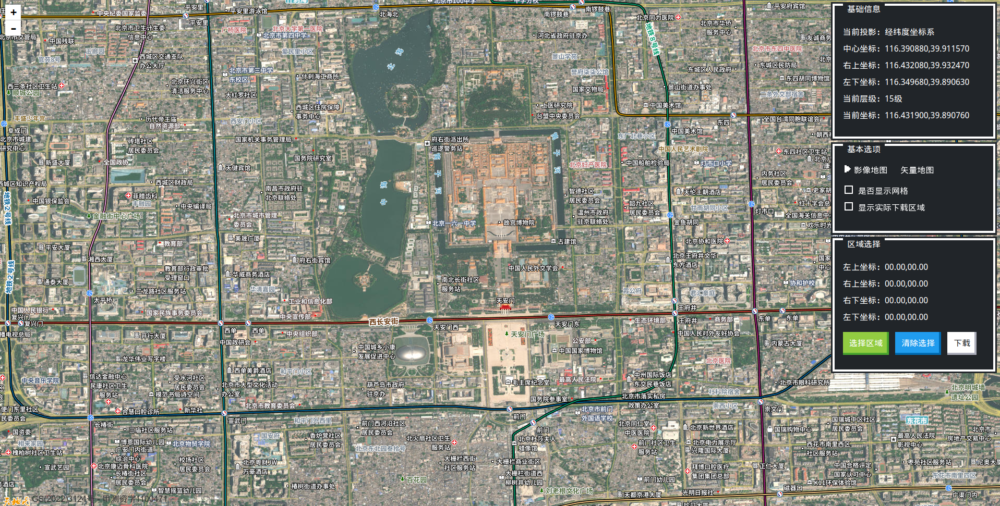
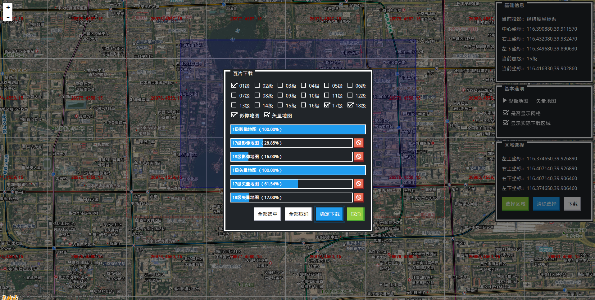
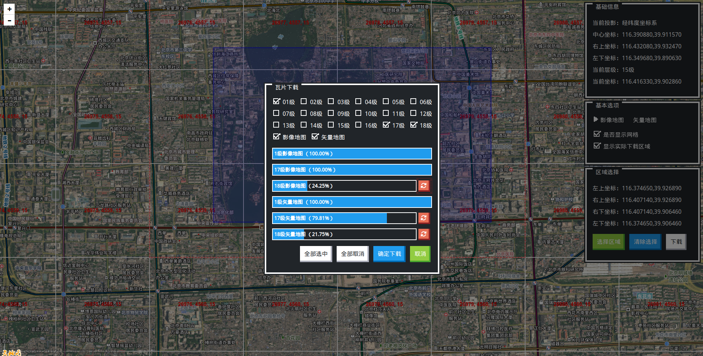

# Mappack 瓦片图打包工具


## 描述

基于`Python Flask`的地图瓦片图打包工具。

> 当前版本仅支持天地图。


## 特色

- 瓦片图下载，下载后可供服务器发布目录索引方式的离线地图。
- 瓦片图大图合成，自动将下载的瓦片图合成完整地图图像。
- 地图图像转换，将合成的完整地图图像转换为`Geotiff`格式的图像文件，适用于发布`geoserver`。


## 运行

```bash
# 进入目录
cd mappack

# 安装项目依赖
pip install -r ./requirements.txt

# 启动Flask
python ./main.py

# 经纬度投影（EPSG4326）地址
http://localhost:5000/tianditu/4326

# 墨卡托投影（EPSG3857）地址
http://localhost:5000/tianditu/3857
```


## 截图









## Bug

- 下载报`Connection pool is full, discarding connection: t0.tianditu.gov.cn. Connection pool size: 1`警告